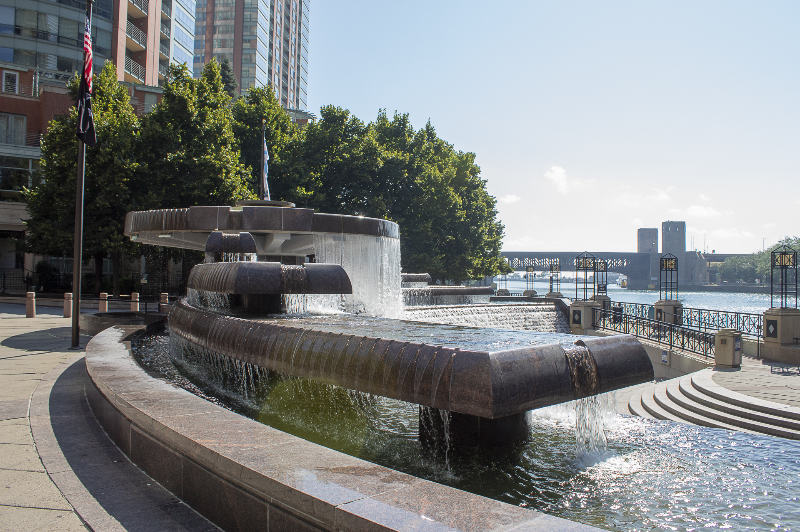
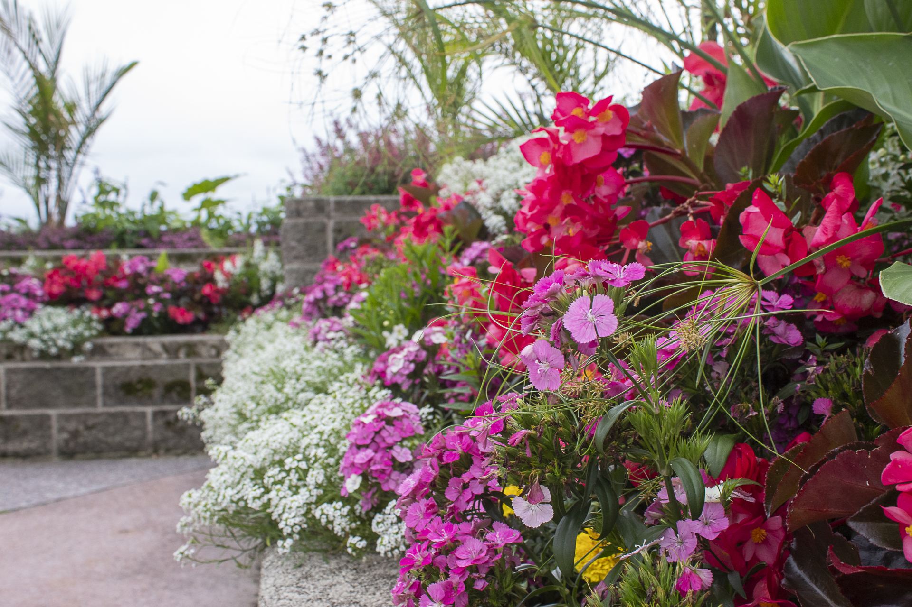

<html>
  <head>
    <title>my website</title>
    
  </head>
  <body>
    <h1>My Photography Website</h1>
    

    <h3>About Me</h3>
    
My name is David Fernandez. I recently started photography as a hobby. I took a photography class in college and I while I am not aiming for a career in photography I do want to improve my skills.

    

    <h3>My Best Photographs</h3>
    

      
      
      
      
      
      
      
      
      
    

  </body>
</html>
