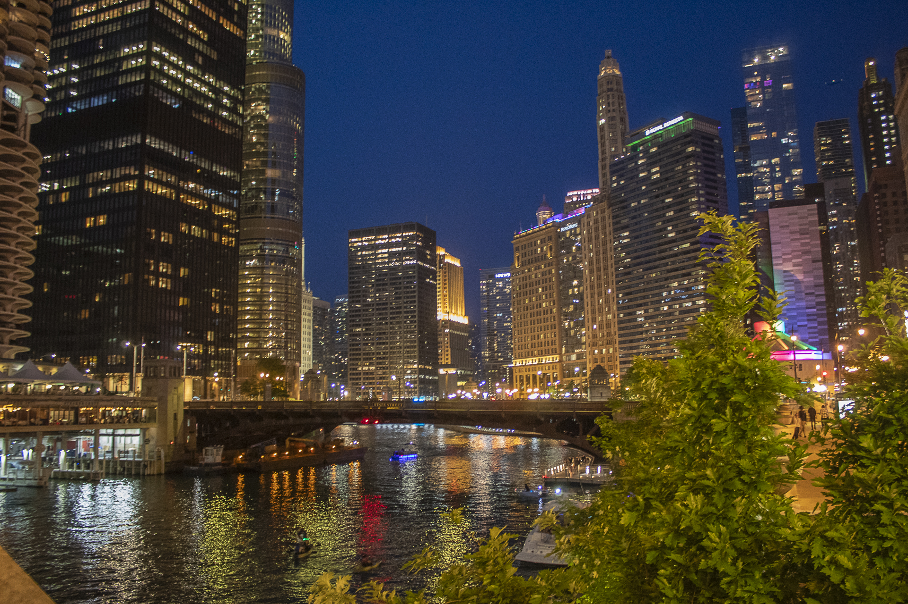
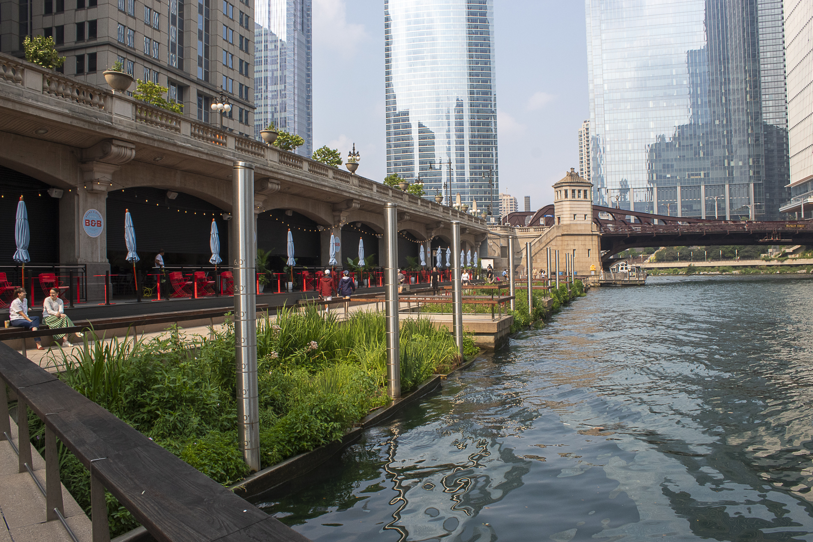

<html>
  <head>
    <title>my website</title>
    <link rel="stylesheet" href="style.css">
  </head>
  <body>
    <h1>My Photography Website</h1>
    

    <h3>About Me</h3>
    
My name is David Fernandez. I recently started photography as a hobby. I took a photography class in college and I while I am not aiming for a career in photography I do want to improve my skills.

    

    <h3>My Best Photographs</h3>
    
    
    
    
    
    
    
    
    
    

    <h3>Project 9: LaBagh Woods</h3>
    
 September 1st, 2025- I was scared that most of my pictures would just be green. Thankfully we were able to find this bridge. I really like how the grafitti gives an abandoned vibe.

    
    
    
    
    
    
    
    
    
    
    <h3>Project 8: Nicholas J. Melas Centennial Fountain</h3>
    
 August 14th, 2025- A big part of photography is composition. The way you angle your camera can greatly affect your photograph. I am not experienced enough to take full advantage of angles, so I decided that a big subject would help develop this skill.

    
    
    
    
    
    
    
    
    
    
    <h3>Project 7: Chicago Riverwalk</h3>
    
 July 31st, 2025- I was told that I should take as many photos as possible. Act as if most of those photos won't see the light of day. Only your best photos will be seen. And with this project I officialy reached 1,000 pictures taken.

    
    
    
    
    
    
    
    
    
    
    <h3>Project 6: Navy Pier Flowers</h3>
    
 July 17th, 2025- This time I wanted to expirement with photos where the subject is visible but with a blurry background. With some mixed results, this is a style I would like to revisit.

    
    
    
    
    
    
    
    
    
    
    <h3>Project 5: 606 Trail Streets</h3>
    
 July 3rd, 2025- Another instant of trying to do another example of my class project. Taking pictures of the trail itself seemed too easy but I did remember of the bridges that let you walk over the streets. Unfortunately there was either too much vegetation or I was too short to take proper pictures of both streets.

    
    
    
    
    
    
    
    
    
    
    <h3>Project 4: Ping Tom Memorial Park</h3>
    
 June 12th, 2025- I think this was the first time I've been to the south side of chicago in general. Photography has reall made me discover different parts of the city. I wish I could have convinced my parent to take the boat tour.

    
    
    
    
    
    
    
    
    
    
    <h3>Project 3: Downtown Turning Dark</h3>
    
 June 2nd, 2025- At this point I've only been downtown after dark once, the year before I started photography. Anyone, even people who don't have an interest in photography, must admit that night photography makes subjects look more interesting. But taking photos with very low light makes chosing the correct settings quite difficult. 

    
    
    
    
    
    
    
    
    
    
    <h3>Project 2: Sidewalk</h3>
    
 April 28th, 2025- During my photography class, we had an assignment where we had to take similar subjects and take the same pictures. Just changing out the subject. For that assignment I took photos of bridges. I wanted to do something similiar so on my way to class I would take pictures of the path ahead of me before crossing the road.

    
    
    
    
    
    
    
    
    
    
    <h3>Project 1: Brownline/Downtown</h3>
    
 December 30th, 2024- This is my first attempt at a personal photography project. I completly forgot to set my ISO to 400. Most of these photos were taken from the brown line CTA. You can tell how dirty the windows were.

    
    
    
    
    
    
    
    
    
    
  </body>
</html>
